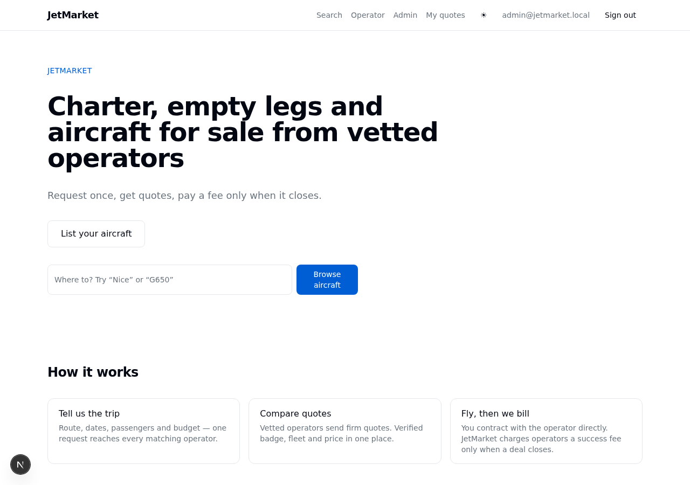
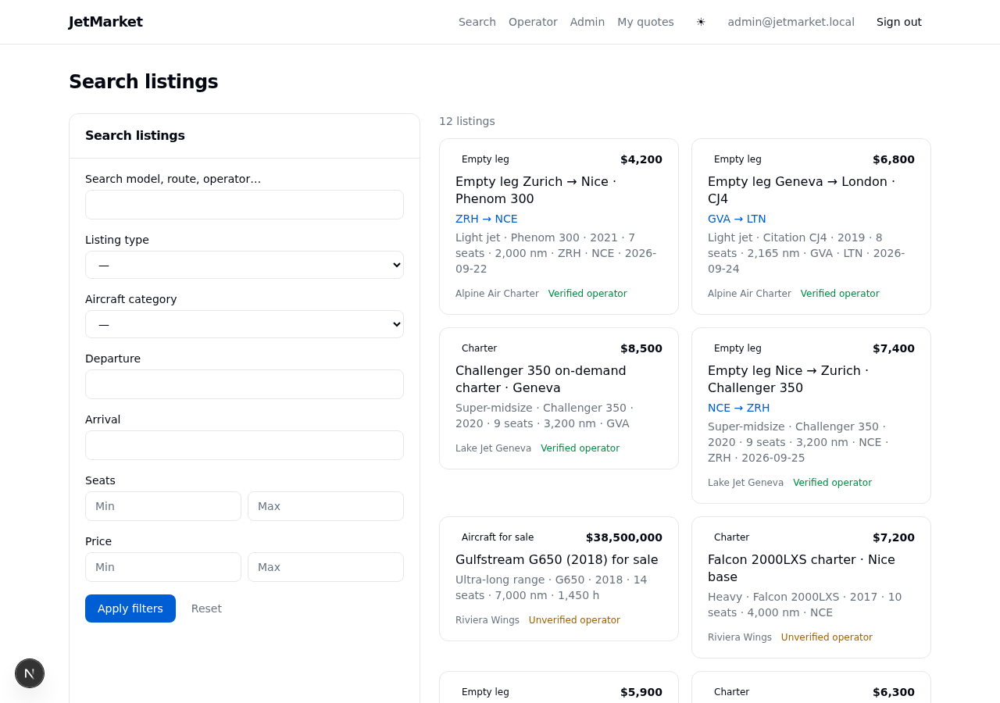
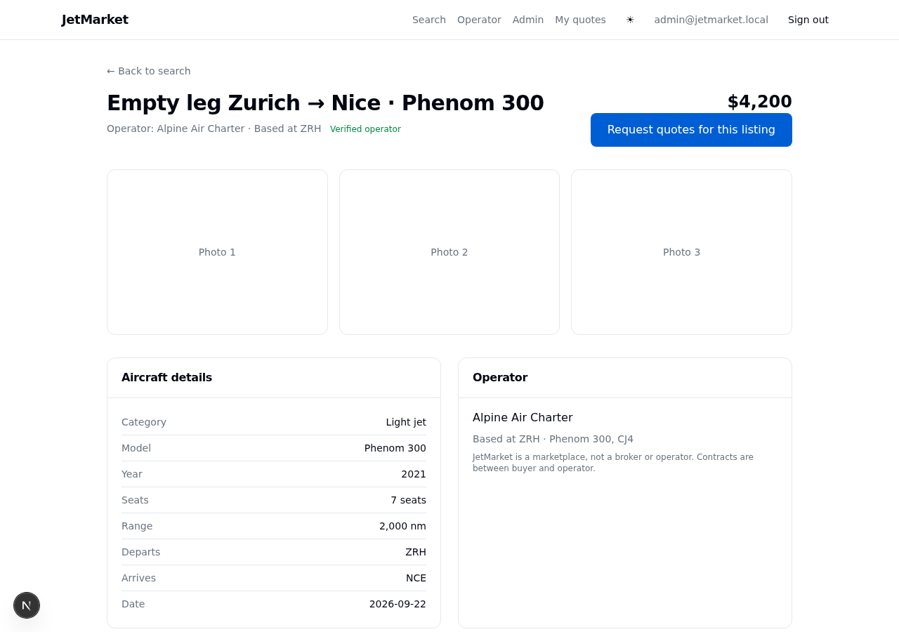
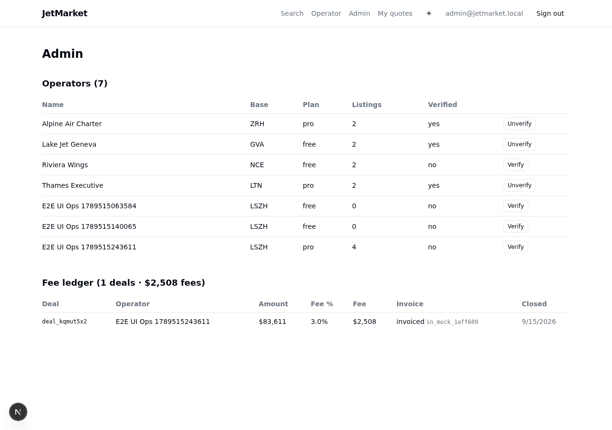

# MORNING_REPORT — jetmarket

## What a user can do right now

A buyer can land on the jets marketplace, browse curated listings (charter,
empty legs, aircraft for sale) via search/facets or one of 10 SEO landing pages
(e.g. `/empty-legs-zurich-nice`), open a listing detail (OG/Twitter meta +
JSON-LD Product schema), and submit an RFQ through a captcha+rate-limit+
honeypot-guarded form. An operator signs in by magic link, onboards, publishes
listings from a config-driven form (free plan caps at 3; Pro $199/mo via the
payments provider), receives RFQs in an inbox, sends priced quotes, and the
buyer accepts — the RFQ closes, a deal is written with the success fee
(3% charter/empty-leg, 1.5% sale) and lands on the admin fee ledger as an
invoice. Admins verify operators and watch the ledger. A second vertical
(machinery) boots the same core loop via `VERTICAL=machinery`. Everything runs
offline in mock mode (`pnpm i && pnpm db:up && pnpm dev`).

 ·  ·
 · 

## Tests

- **unit**: 119 tests — `pnpm -r test` green (verticals 15, domain 42, db 5, providers 14, worker 5, apps/web 38 incl. lifecycle-route + analytics assertions).
- **integration**: 15 cases, 4 files (`repo.contract` shared suite executed against memory + drizzle backends, worker, db migrations, meilisearch) — green on CI; skipped locally here (Docker Hub pull rate-limited).
- **contract**: 8 cases, 3 files (stripe-mock, Mailpit, provider env-selection) — green on CI; skipped locally here for the same reason.
- **e2e**: 6 Playwright tests, 5 specs — jets chromium: core-loop UI + API + quote-decline UI + RFQ abuse; machinery project: vertical acceptance — green on CI (both legs). Repo smoke (`pnpm smoke`) green.

## CI

Latest green run on `main`: https://github.com/ypxz/jetmarket/actions/runs/35035598699 — `ci` workflow (lint+typecheck+unit, integration w/ Postgres, contract w/ stripe-mock+Mailpit, e2e Playwright) all green.

## GO_LIVE summary

- **Accounts to create**: Vercel or Fly.io (host web+worker), Supabase or Neon (Postgres/Auth/Storage), Stripe (KYC — subscriptions + fee invoices), Resend or SES (transactional email), Cloudflare Turnstile (RFQ spam guard); optional Meilisearch Cloud, S3/R2.
- **Env vars to fill**: flip `*_PROVIDER` from `mock` to real and set the keys in `.env.example` — `DATABASE_URL`, `SESSION_SECRET`, `ADMIN_EMAILS`, `STRIPE_SECRET_KEY`/`STRIPE_WEBHOOK_SECRET`, `SMTP_URL` or `RESEND_API_KEY`, `TURNSTILE_SECRET_KEY` + `NEXT_PUBLIC_TURNSTILE_SITE_KEY`, optional `MEILISEARCH_URL`/`MEILISEARCH_KEY`, `APP_URL`, `VERTICAL`. Typed `real.ts` skeletons marked `TODO(go-live)` must be finished against provider sandboxes first.
- **Est. monthly cost**: ~$0–105 at launch (all listed services have free tiers; Stripe adds % fees).

## Reused OSS + licenses

| Package | License | Role |
|---|---|---|
| Next.js 15 / React 19 | MIT | apps/web framework + UI |
| TypeScript 5 | Apache-2 | all packages |
| pnpm 9 | MIT | workspace |
| Tailwind CSS 4 | MIT | styling via template tokens |
| shadcn/ui (Radix) | MIT | UI primitives |
| next-intl 3 | MIT | i18n |
| Drizzle ORM | Apache-2 | packages/db |
| postgres.js | Unlicense† | DB driver (†public-domain — `pg` MIT fallback recorded) |
| zod 3 | MIT | vertical attribute/RFQ schemas |
| Vitest | MIT | unit + integration |
| Playwright | Apache-2 | e2e |
| stripe SDK | MIT | payments real adapter (vs stripe-mock) |
| nodemailer | MIT | SMTP adapter (vs Mailpit) |
| stripe-mock / Mailpit | MIT (Docker images) | contract tests / dev SMTP |

Ideas-only, not reused (license or weight): sharetribe (SCPL 1.0), medusajs,
n8n, shadcn-ui/taxonomy, vercel/nextjs-subscription-payments, vercel/commerce —
detail in `RESEARCH.md` §1.

## Known gaps

- Real provider impls are typed skeletons (`TODO(go-live)`): Stripe live, Resend/SES, Turnstile, Supabase Auth+Storage, Meilisearch — all verified only against mocks.
- SEO is thin: 10 landing-page stubs share a generic intro fallback; `en` locale only; `og:image` now generated per listing + site-wide card (ImageResponse, first-party — no hotlinking).
- RFQ rate limit is an in-process `Map` — single-instance only, needs a shared store behind >1 replica.
- Operator verification is manual admin-only; no document/KYC flow.
- No buyer-facing account area beyond the magic-link quotes page (accept/decline live); operator RFQ inbox shows sent quotes + withdraw but has no per-RFQ detail view.
- Machinery vertical is a placeholder taxonomy proving configurability, not a real second market.
- Analytics is event-name plumbing into a mock sink; no destination wired.

## Decisions we made for you

- Marketplace-not-broker positioning everywhere (footer + ToS copy) — keeps the legal story simple.
- Zero-key mock mode as the default (`REPO=memory`, all providers mock) so the repo runs fully offline; Postgres parity proven via a shared repo contract suite on both backends.
- Fee model: Pro subscription $199/mo + success fee 3% charter/empty-leg, 1.5% sale — from `packages/verticals` fees config, not hard-coded.
- `Product` JSON-LD (not `Vehicle`) since listings span charter/legs/sale; `page_view` analytics skipped — SSR tracking needs request-context plumbing for little mock-mode value.
- postgres.js `Unlicense` kept with an explicit flag + MIT `pg` fallback rather than swapping silently.
- A second vertical (machinery) shipped early to prove the config-driven marketplace loop generalizes.

## Confidence this reaches CHF 1k MRR in 6 months: 5/10

The money loop is real end-to-end — listings → RFQ → quote → accept → deal →
fee invoice — with provider seams at every external edge, so the gap to
production is mostly finishing `real.ts` impls against sandboxes. The hard
risks are supply-side cold-start (needs ~20 operators, per
`marketing/operator-outreach.md`) and that nothing has touched real Stripe/
email/auth traffic yet — a bad first week with one provider could eat a month.
